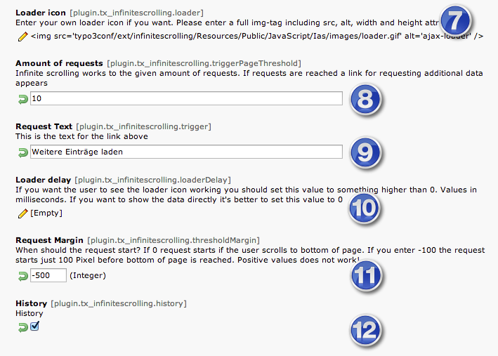

============================
Administrator Manual
============================

Infinite scroll is a frontend extension without plugin.

Target group: **Administrators**

Installation
=============

The extension requires TYPO3 version 4.5 or higher.

Install the extension via the extension manager. There are no changes to the database structure or configuration
options in the extension manager

The configuration of the extension is done with TypoScript constants. You need to create an TypoScript extension
template on the page(s) that contain a list view of the plug-ins. In the extension template, make sure to add the
supplied Infinite Scrolling module:

.. figure:: Images/infinite-scroll-ts-config.png
		:width: 800px
		:alt: Adding the TypoScript module

		Adding the TypoScript module to the template

Switch to the constant editor to configure the extension and select the INFINITESCROLLING category:

.. figure:: Images/infinite-scroll-ts-constants1.png

	:width: 400px

	:alt: Configuration of TypoScript constants

	Configuration of TypoScript constants (1)

The following configuration example is for the tt_news extension:

[1] Include jQuery file
	The infinitescrolling function requires the jQuery library to be available. A version of jQuery is automatically
	loaded by default (from the Google API servers). If you already have a current version of jQuery in loaded in
	your website, you need to clear this entry. If you want to use the jQuery extension from the Google servers
	instead of an already loaded version in your website, you need to disable your own version. This can typically
	done with TypoScript.
	*Note :* Make sure that you don not load multiple copies of jQuery libraries on your website. This add overhead
	and may lead to incompatibilies.

[2] Selector for container
	The plug-in typically has a 
 container which encloses the complete list-view. Enter the div attribute and
	class name here. For tt_news this is *div.news-list-container*

[3]	Selector for scroll container

[4] Selector for item
	Each data record in the list view is surrounded by a 
 container. Enter the div attribute and
	class name here. For tt_news this is *div.news-list-item*

[5]	Selector for paginator
	The page browser above or below the list view is enclosed in a 
 container. Enter the div attribute and
	class name here. For tt_news this is *div.news-list-browse*

[6] Selector for next link
	The extensions implements loading of the next data records by "clicking" on the "Next" link in the page
	browser. See the following HTML code sample for the page browser:

.. code-block:: html
   :emphasize-lines: 10,10

	

		

			&lt;&lt; First
			&lt; Previous
			Page 1
			<a href="aktuelles/uebersicht/1.html" target="_top">Page 2</a>
			<a href="aktuelles/uebersicht/2.html" target="_top">Page 3</a>
			<a href="aktuelles/uebersicht/3.html" target="_top">Page 4</a>
			<a href="aktuelles/uebersicht/4.html" target="_top">Page 5</a>
			<a href="aktuelles/uebersicht/1.html" target="_top">Next &gt;</a>
			<a href="aktuelles/uebersicht/31.html" target="_top">Last &gt;&gt;</a>
		

	

	We need to specify, which of the links is used to fetch the data for the. Inside the 
 container with
	class browseLinksWrap it is the second last link (see highlighted line in above code sample).
	Therefore we need to specify: *div.browseLinksWrap a:eq(-2)*

Optional Configuration
^^^^^^^^^^^^^^^^^^^^^^

		Configuration of TypoScript constants (2)

[7] Loader Icon
	This is the path to the animated GIF image for the spinner, which is visible while the next data records are
	being fetched from the server. If you want to use your own icon, specifiy it here.

[8] Amount of requests
	Here you specify, how many pages with data records should be fetched with infinite scrolling. If your list view
	contains 5 items (e.g. news records) and you specify 10 requests, a total of 50 data records will retrieved
	with infinite scrolling. If still more data is available, a link will be displayed below the last item. With
	each click on the link, another page of data records will be retrieved from the server. Unless you set this entry
	to a very high number, the scrolling of the extension will not be "infinite", but limited to requests x items per page.

[9]	Request Text
	Enter a text that appears when you have reached the end of your infinite scolling (see [8]). The text is displayed
	below the last entry.
	*Note:* if you have a website with multiple languages, you need to use TypoScript conditions to set the entry for
	each language.

[10] Loader delay
	You can specify in milliseconds whether there should be a delay between reaching the end of the page and the
	start of the request for the next data records. For maximum speed, set this to 0. However, if you have designed
	a beautiful spinner icon and want to show it to the user for one second (before loading anything), set it to 1000.

[11] Request Margin
	Here you define, at which point in the scrolling you start to load more data records in the background. Lets assume
	your list view is 1000 px in height and you set this entry to -500, loading of additional records will start after
	the user has scrolled trough the half of the page. This is a nice feature to load more data ahead of time.
	When setting the value to 0, loading will start, once the user has scrolled completely down. Only negative values
	are allowed.

[12] History
	When this option is enabled, the extension will add anchors to the URL of the page in the form #/page/1, #/page/2, ...
	This feature allows to set bookmarks in the browser to a specific section of the list.

