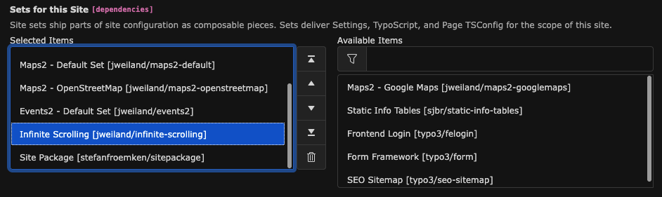
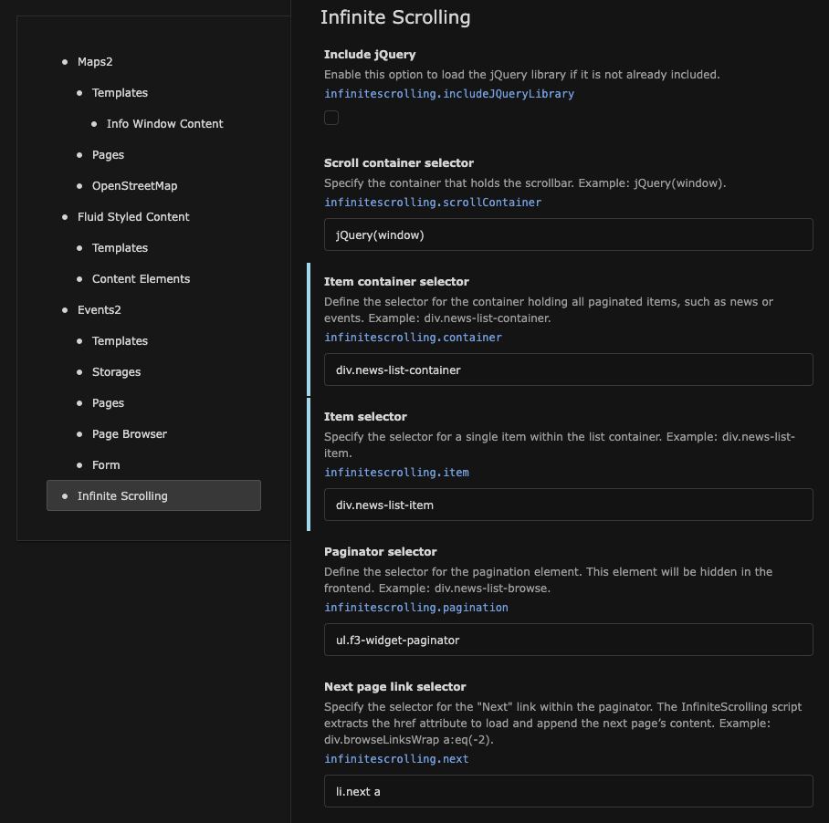
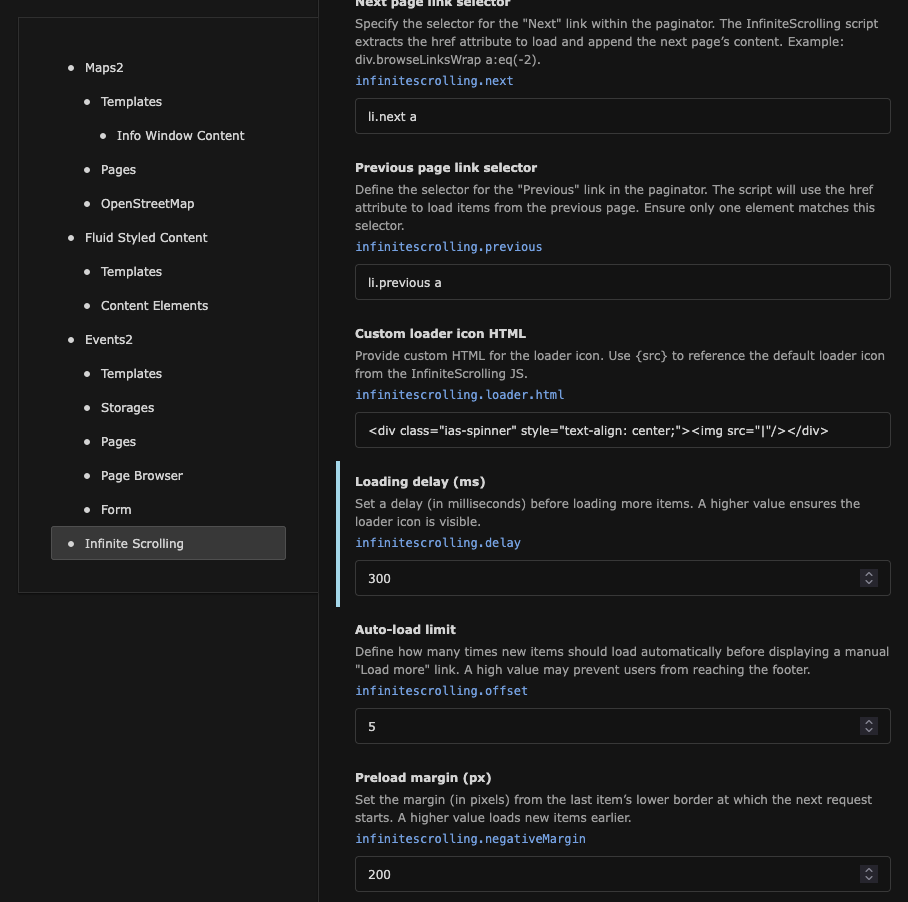

:navigation-title: Configuration

..  _configuration:

=============
Configuration
=============

..  _configuration-add-site-settings:

Add Site Settings
=================

Infinite Scrolling is a frontend extension that does not require a plugin.

To configure the extension, navigate to :guilabel:`Site Management -> Sites`
and add the :guilabel:`Infinite Scrolling` Site Set to your Site configuration.

    Adding the Infinite Scrolling Site Set

..  _configuration-site-settings:

Site Settings
=============

Go to :guilabel:`Site Management -> Settings`, select your Site configuration,
and scroll down to :guilabel:`Infinite Scrolling`.

    Configure the first section of Site Settings

..  confval:: Include jQuery
    :type: boolean
    :Default: false
    :Path: infinitescrolling.includeJQueryLibrary

    Enable this option to include the jQuery JavaScript library.

..  confval:: Scroll container selector
    :type: string
    :Default: jQuery(window)
    :Path: infinitescrolling.scrollContainer

    Define the jQuery selector for the scroll container.

    Sample: `jQuery(window)`

..  confval:: Item container selector
    :type: string
    :Default: (none)
    :Path: infinitescrolling.container

    Specify the jQuery selector for the container holding all
    items (e.g., news or events) to paginate.

    Sample: `div.news-list-container`

..  confval:: Item selector
    :type: string
    :Default: (none)
    :Path: infinitescrolling.item

    Specify the jQuery selector for a single item within the list container.

    Sample: `div.news-list-item`

..  confval:: Pagination selector
    :type: string
    :Default: ul.f3-widget-paginator
    :Path: infinitescrolling.pagination

    Define the jQuery selector for the paginator. This selector will hide the
    paginator in the frontend.

    Sample: `div.news-list-browse`

..  confval:: Next page link selector
    :type: string
    :Default: li.next a
    :Path: infinitescrolling.next

    Define the jQuery selector for the "Next" link in the paginator. The
    href attribute will be used to load and append the next page’s content.

    Sample: `div.browseLinksWrap a:eq(-2)`

    Configure the second section of Site Settings

..  confval:: Previous page link selector
    :type: string
    :Default: li.previous a
    :Path: infinitescrolling.previous

    Define the jQuery selector for the "Previous" link in the paginator. The
    href attribute of this element will be used to retrieve items from the
    previous page. Ensure only one element matches the selector.

    Sample: `li.previous a`

..  confval:: Custom loader icon HTML
    :type: string
    :Default: 

    :Path: infinitescrolling.loader.html

    Customize the loader icon by specifying your own HTML. Use {src} to include
    the original loader icon from Infinite Scrolling JS.

    Sample: `

`

..  confval:: Loading delay (ms)
    :type: int
    :Default: 0
    :Path: infinitescrolling.delay

    Set a delay (in milliseconds) before loading additional items. Increase
    this value to ensure the loader icon is visible longer.

    Sample: `5`

..  confval:: Auto-load limit
    :type: int
    :Default: 5
    :Path: infinitescrolling.offset

    Define how many times new items should be automatically loaded before
    displaying a manual "Load More" button. Avoid setting this too high to keep
    the footer accessible.

    Sample: `7`

..  confval:: Preload margin (px)
    :type: int
    :Default: 200
    :Path: infinitescrolling.negativeMargin

    Set the margin (in pixels) from the last item's bottom edge before the next
    request starts. A higher value loads items earlier.

    Sample: `130`
