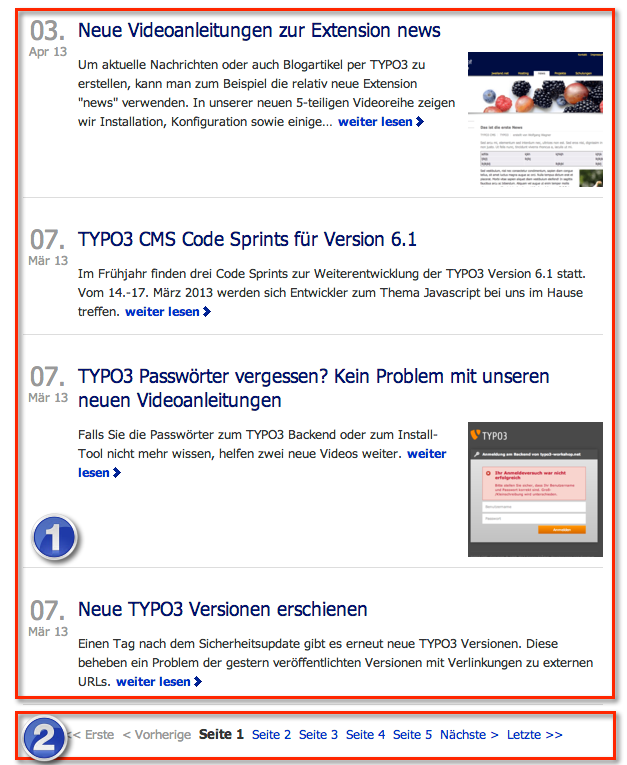

..  include:: /Includes.rst.txt

..  _introduction:

============
Introduction
============

The extension "Infinite Scrolling" is replacing the page browser at the bottom
with an endless scrolling feature. This function has become popular with
applications like Twitter and Facebook. When viewing a list of entries, more
data records are automatically loaded from the server when you are scrolling
down to the end of the page.

The result is an improved user experience, since more (or all) data records can
be viewed without navigating to the page browser and clicking on a link.

The Infinite Scrolling extension can be implemented in existing TYPO3 projects
without changing the code of the extension plugin or the HTML template.

The page browser will only be hidden on the page, not deleted. Therefore the
page browser is still accessible, e.g. for screen readers.

The extension implements the jQuery plugin 'jquery-ias.js' by Jeroen Fiege.
For details visit http://www.fieg.nl/infinite-ajax-scroll-a-jquery-plugin

Please keep in mind that JavaScript behind `infinitescrolling` is
OpenSource (MIT licence) but should be paid for commercial-use:
https://infiniteajaxscroll.com/download.html

..  _what-it-does:

What does it do?
================

Many TYPO3 extension plugins provide a list view for output. Typically 5 to 20
data records are shown in list view [1], each with a link to the single view.
If there are more than a predefined number of records to show, a
page browser [2] is used to switch between pages of the list view (see
image below):

    Standard list view of tt_news with page browser at bottom

    A working example can be seen at https://jweiland.net/aktuelles.html
